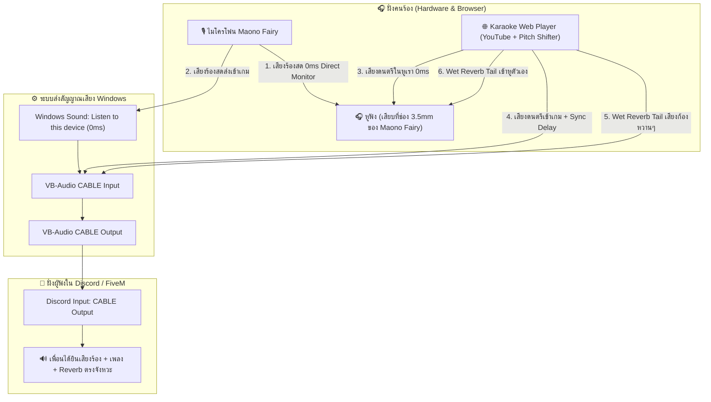

# 🎤 Karaoke Sync Player & Audio Routing Guide (คู่มือการตั้งค่าและแก้ปัญหาเสียง)

เอกสารสรุปสถาปัตยกรรมระบบเสียง การเชื่อมต่อสายสัญญาณ (Routing), การใส่เอฟเฟกต์ Reverb (เสียงก้อง), และการปรับจังหวะลดดีเลย์ (Sync Calibration) สำหรับร้องเพลงใน **Discord / FiveM / TikTok Live**

---

## 🏗️ 1. สถาปัตยกรรมระบบเสียง (Audio Architecture Overview)

---

## 🎛️ 2. ตารางการตั้งค่าอุปกรณ์ (Device Configuration Matrix)

| อุปกรณ์ / โปรแกรม | ค่าที่ต้องเลือก (Device Selection) | วัตถุประสงค์ |
| :--- | :--- | :--- |
| **Windows Recording (mmsys.cpl)** | `Microphone (Maono Fairy)` $\rightarrow$ ติ๊ก `[✓] Listen to this device` $\rightarrow$ ส่งไปที่ `CABLE Input` | ส่งเสียงพูด/เสียงร้องเข้า Discord แบบ 0ms |
| **Windows Recording (CABLE Output)** | `CABLE Output` $\rightarrow$ **[ ] ปิด Listen to this device** | ป้องกันเสียงวนลูปสะท้อน (Echo Loopback) |
| **Karaoke Player (ช่อง 1 - หูฟัง)** | `Headphones (Maono Fairy)` | ฟังเสียงดนตรีคาราโอเกะ + เสียง Reverb ตัวเอง |
| **Karaoke Player (ช่อง 2 - ส่งเข้าเกม)** | `CABLE Input (VB-Audio Virtual Cable)` | รวมเสียงเพลงและ Reverb ส่งเข้า Discord |
| **Discord Settings** | Input: `CABLE Output` Output: `Headphones (Maono Fairy)` | เพื่อนได้ยินเสียงผสมสมบูรณ์แบบ |

---

## ✨ 3. ระบบ Studio Vocal Reverb (เสียงก้องสตูดิโอ)

* **หลักการทำงาน**: 
  - เสียงร้องสด (Dry Vocal) จะวิ่งผ่านฮาร์ดแวร์ไมค์ Maono Fairy ตรงเข้าหูและ Discord โดย **ไม่ผ่านการหน่วงของบราวเซอร์ (0ms)**
  - บราวเซอร์จะทำหน้าที่สร้างเฉพาะ **"หางเสียงก้อง (Wet Reverb Tail)"** ผ่านอัลกอริทึม **Convolution Impulse Response (IR)**
  - เสียงก้องนี้จะถูกส่งไปทั้ง **หูฟังของเรา** (เพื่อให้เราร้องสนุกขึ้น) และ **ส่งเข้า Discord** (ให้เพื่อนฟังเสียงเราหวานนุ่ม)
* **การปรับค่าแนะนำ**:
  - **Wet Mix**: `20% - 30%` (ความหวานฉ่ำของเสียงก้อง)
  - **Decay Time**: `1.6s - 2.0s` (ความยาวของหางเสียงสะท้อน)
  - **Room Type**: `Studio` หรือ `Hall`

---

## ⏱️ 4. การปรับจังหวะเพลงชดเชยดีเลย์ (Sync Latency Compensation)

เมื่อร้องเพลงแล้วเพื่อนใน Discord บอกว่าจังหวะไม่ตรง ให้ปรับที่แถบ **`⏱️ ปรับชดเชยจังหวะเพลงเข้า Discord`**:

* **กรณีที่ 1**: เพื่อนบอกว่า *"เสียงร้องดังก่อนดนตรี"* 
  $\rightarrow$ เลื่อนแถบ Sync Offset **เพิ่มขึ้น** (เช่น `+50ms`, `+80ms`, `+100ms`) เพื่อหน่วงเพลงให้ลงตรงกับคำร้อง
* **กรณีที่ 2**: เพื่อนบอกว่า *"ดนตรีไปก่อนเสียงร้อง"*
  $\rightarrow$ ปรับแถบ Sync Offset กลับมาที่ `0ms`
* *(หมายเหตุ: การปรับแถบนี้จะขยับเฉพาะสัญญาณที่ส่งไป Discord ส่วนเสียงเพลงในหูเราจะยังคงคมชัดและตรง 0ms ตามปกติ)*

---

## 🎮 5. ปุ่มลัดควบคุม (Hotkeys Guide)

| ปุ่มลัด (Hotkey) | ฟังก์ชัน | รายละเอียด |
| :--- | :--- | :--- |
| **`F8`** หรือ **`Numpad -`** หรือ **`~`** | **Talk Mode (Ducking)** | สลับโหมดพูดคุย / ร้องเพลง (เบาเสียงเพลงอัตโนมัติ 80% เวลาจะคุยกับเพื่อน) |
| **`Spacebar`** | **Play / Pause** | เล่นเพลง / หยุดเพลงชั่วคราว |
| **`F5`** | **Reload Engine** | รีเซ็ตระบบเสียงและหน้าเว็บเมื่อมีการเปลี่ยนสายสัญญาณ |

---

## 🛠️ 6. วิธีแก้ปัญหาที่พบบ่อย (Troubleshooting)

1. **เพื่อนได้ยินเสียงเอคโค่ / เสียงเบิ้ล 2 ชั้น**:
   - ตรวจดูว่าใน Windows Sound ที่ตัว `CABLE Output` **ไม่ได้ติ๊ก** `Listen to this device`
   - ปิดเสียงลำโพงภายนอก (Soundbar) และใช้หูฟังเท่านั้น
2. **เพื่อนไม่ได้ยินเสียงเพลง**:
   - ตรวจดูว่าช่อง **"2. ส่งเข้าเกม"** ในหน้าเว็บเลือกเป็น `CABLE Input (VB-Audio Virtual Cable)` และ Volume เปิดอยู่ที่ 80-90%
3. **ไม่ได้ยินเสียง Reverb ในหู**:
   - สวิตช์ **Studio Vocal Reverb** ต้องเปิดเป็น `ON`
   - เพิ่มแถบ **Wet Mix** ขึ้นไปที่ `30%`
