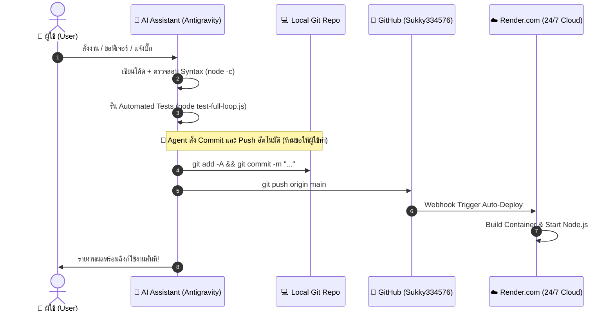

# 📘 WORKFLOW & DEPLOYMENT PROTOCOL

> **คู่มือมาตรฐานการทำงานและขั้นตอนการนำขึ้น Production อัตโนมัติ**

---

## 🔄 วงจรการพัฒนาและ Deploy อัตโนมัติ (End-to-End Workflow)



---

## ⚙️ ข้อมูลการเชื่อมต่อเซิร์ฟเวอร์และ Production Config

| รายการ | รายละเอียด / ที่อยู่ |
|---|---|
| **Production 24/7 URL** | `https://nocturne-karaoke-backend.onrender.com` |
| **Local Engine URL** | `http://localhost:3300` |
| **GitHub Repository** | `https://github.com/Sukky334576/nocturne-karaoke-backend.git` |
| **Git Branch** | `main` |
| **Git Remote Name** | `origin` (บันทึก Token ใน Remote URL เรียบร้อยแล้ว) |
| **Render Service Type** | Node.js Web Service (Free Tier, Always-On with Heartbeat) |
| **Build Command** | `npm install` |
| **Start Command** | `node server.js` |

---

## 🛠️ คำสั่งสำหรับ Agent ในการ Deploy อัตโนมัติ

```powershell
# 1. ตรวจสอบ Syntax
node -c server.js public/app.js public/plugin-sdk.js

# 2. รันทดสอบระบบ
node test-full-loop.js

# 3. นำขึ้น Production อัตโนมัติทันที
bin\git\cmd\git.exe add -A
bin\git\cmd\git.exe commit -m "feat/fix: <รายละเอียด>"
bin\git\cmd\git.exe push origin main
```

---

## 🎧 กฎเหล็กด้านระบบเสียงและการตั้งค่าฮาร์ดแวร์ของผู้ใช้

1. **การ์ดเสียง Maono Fairy:**
   * ตัวการ์ดเสียงมี Direct Monitoring (เสียงไมค์สดออกหูฟังแบบ 0ms) ในตัวอยู่แล้ว
   * ในโค้ด `public/app.js` ค่า `hpVocalVol` (เสียงร้องออกหูฟัง) **ต้องเป็น 0% (Muted) เสมอ** มิฉะนั้นผู้ใช้จะได้ยินเสียงพูดสะท้อนในหู
2. **การส่งเสียงเข้า Discord / FiveM:**
   * สัญญาณเสียงร้อง (ผ่าน Gate, Comp, Modular FX Rack, Auto-Tune) และเสียงดนตรีจะถูกส่งเข้า `CABLE Input (VB-Audio Virtual Cable)`
   * ค่า Preset Sync Offset ที่เหมาะสมคือ **120ms** เพื่อชดเชยการประมวลผลของ Discord
3. **การเล่นเพลงบน Cloud (Render):**
   * YouTube มีระบบบล็อกการดึง Audio Stream จาก Data Center IP (HTTP 500)
   * โค้ดถูกเขียนให้ตรวจจับ `isCloudHost` อัตโนมัติ และใช้ **Direct YouTube High-Definition Player** โดยเชื่อมต่อระดับเสียงเข้ากับ Slider ห้ามสั่ง Mute เครื่องเล่น YouTube ในโหมด Cloud
